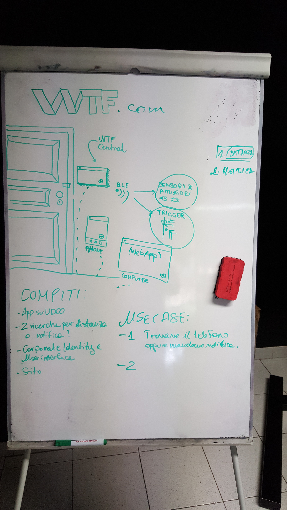

# wtf-docs

**WTF** is the acronym for "**W**ha**T** I **F**orgot?" (no, this is not [what you probably thought...](http://s2.quickmeme.com/img/d0/d0374478557798edfc964afd006512de457207f70346d8e2ef524a98afd73578.jpg))

This is the main project repository of the WTF Team at [Hackaton droidcon Italy 2016](http://it.droidcon.com/2016/hackathon-droidcon-italy/).

### Team Members

1. [Gianpaolo Macario](https://github.com/gmacario)
1. [Wilfried Mbouenda Mbogne](https://github.com/WillyShakes)
1. [Giuseppe Nesca](https://github.com/neskov7)
1. [Alessandro Censi](https://github.com/AleDroid93)
1. [Paolo Marino](https://github.com/dolcestilnuovo65)
1. [Alessandro Morelli](https://github.com/AlessandroMorelli96)
1. [Umberto Pepato](https://github.com/umbHo)
1. [Alessandro Shevera](https://github.com/AlessandroBDP)

### The idea

Use Cases:

1. Esco di casa e dimentico il telefono in casa (oggi)
      - every object will have a beacon on it (cover,gadjets, etc)
      - Udoo will scan all beacon (true/false) in a restricted area
      - we' ll use google calendar API (text message for schedule)
      - 
2. Esco di casa e dimentico di chiudere il gas (domani)

### The architecture
      

* There is an Android app on the UDDO NEO with a local database and in future it'll have a cloud service
* We will use the MVP ([Mode-View-Presenter](https://en.wikipedia.org/wiki/Model%E2%80%93view%E2%80%93presenter) pattern

### WTF - Work Breakdown Structure

* Project Setup

  - [X] Create project page - See https://github.com/gmacario/wtf-docs
    - [X] Document Team Members, skills
    - [X] Write and agree on project charter
  - [ ] Create chat room - See Gitter.im

* Develop Architecture

  - [X] Identify two use-cases

* Project infrastructure

  - [X] [Setup webserver infrastructure (nginx)](https://github.com/gmacario/wtf-docs/issues/2)
  - [ ] [Install Docker on VM](https://github.com/gmacario/wtf-docs/issues/3)
  - [ ] [Setup Jenkins](https://github.com/gmacario/wtf-docs/issues/4)
  - [ ] [Create Jenkins job to build UDOO app](https://github.com/gmacario/wtf-docs/issues/5)
  - [ ] [Deploy APK to UDOO](https://github.com/gmacario/wtf-docs/issues/6)

* WTF Application (on the UDOO)

  - [X] Create an empty project https://github.com/WillyShakes/UdooWtf
  - [ ] Create a class for the beacon discovery (output: list of devices object)
  - [ ] Create the model class devices and the database (crud metods)
  - [ ] Create a class to read the data on the Udoo hardware
  - [ ] Create an activity to test the first use case
  - [ ] Add the Google Calendar API (@umbho)

* Branding identity

  - [ ] GUIs
  - [ ] Web dashboard (2.0)

* Prepare pitch

  - TODO

TODO

### Repositories

* https://github.com/WillyShakes/UdooWtf
* TODO

#### The hardware for Hackaton PoC

* [UDOO NEO](http://www.udoo.org/udoo-neo/)
* [KIT LCD 7"" - Touch for NEO](http://shop.udoo.org/eu/accessories/video-kit-7-touch-for-neo.html)
* [IoTSemplice](http://www.iotsemplice.com/)
* ...

A big thanks to the sponsors:

* [UDOO](http://www.udoo.org)
* [IoTSemplice](http://www.iotsemplice.com/)
* [Talent Garden](http://talentgarden.org/)

<!-- EOF -->
