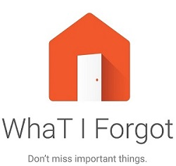

# wtf-docs

This is the top level repository of the **WTF** project.

The WTF project was started during the [Hackaton droidcon Italy 2016](http://it.droidcon.com/2016/hackathon-droidcon-italy/) and got awarded the first prize offered by the [AAL Programme](http://www.aalforum.eu/).

If you wonder what WTF stands for, it is the acronym for "**W**ha**T** I **F**orgot?" (no, it does not mean [what you might have thought...](http://s2.quickmeme.com/img/d0/d0374478557798edfc964afd006512de457207f70346d8e2ef524a98afd73578.jpg))

### Team Members

1. [Gianpaolo Macario](https://github.com/gmacario) - Architecture, Continuous Integration, Linux hacker
1. [Wilfried Mbouenda Mbogne](https://github.com/WillyShakes) - Architecture, Android guru
1. [Giuseppe Nesca](https://github.com/neskov7) - Java, Android, XML, Input/Output
1. [Alessandro Censi](https://github.com/AleDroid93) - Java, Android
1. [Paolo Marino](https://github.com/dolcestilnuovo65) - Java, Database
1. [Alessandro Morelli](https://github.com/AlessandroMorelli96) - Java, Android
1. [Umberto Pepato](https://github.com/umbHo) - Branding, UI Design, Presentation Material
1. [Alessandro Szewera](https://github.com/AlessandroBDP) - Presentation, Marketing Spetialist

Additionally, [Adam Szewera](https://github.com/adamszewe) acted as team mentor.

### The idea

Use Cases:

1. I leave home but forgot my home in the house
    - Every object will have a beacon on it (cover, gadgets, etc)
    - The UDOO NEO will scan all beacon (true/false) in a restricted area
    - We will use Google Calendar API (text message for schedule)

2. I leave home but forgot to turn off gas tap
    - Door sensor is an input of IoTSemplice
    - Gas tap is an output of IoTSemplice

### The architecture

* There is an Android app on the UDOO NEO with a local database; in future it will have a cloud service
* We will use the MVP ([Mode-View-Presenter](https://en.wikipedia.org/wiki/Model%E2%80%93view%E2%80%93presenter)) pattern

### WTF - Work Breakdown Structure

* Project Setup

  - [X] Create project page - See https://github.com/gmacario/wtf-docs
    - [X] Document Team Members, skills
    - [X] Write and agree on project charter
  - [X] Create chat room - See https://github.com/gmacario/wtf-docs/issues/11

* Develop Architecture

  - [X] Identify two use-cases

* Project infrastructure

  - [X] [Setup webserver infrastructure (nginx)](https://github.com/gmacario/wtf-docs/issues/2) ==> http://wtf.solarma.it/
  - [X] [Install Docker on VM](https://github.com/gmacario/wtf-docs/issues/3)
  - [X] [Setup Jenkins](https://github.com/gmacario/wtf-docs/issues/4) ==> http://wtf.solarma.it:9080/
  - [X] [Create Jenkins job to build UDOO app](https://github.com/gmacario/wtf-docs/issues/5)
  - [ ] [Deploy APK and test it to UDOO NEO](https://github.com/gmacario/wtf-docs/issues/6)

* WTF Application (on the UDOO) - Top level issue: https://github.com/gmacario/wtf-docs/issues/10

  - [X] Create an empty project https://github.com/WillyShakes/UdooWtf
  - [X] Create a class for the beacon discovery (output: list of devices object BLE) + Filter weFlowgitHub
  - [ ] Create the model class devices and the database (CRUD metods)
  - [ ] Create a class to read a digital input on the UDOO NEO hardware (or from IoTSemplice?)
  - [ ] Create an activity to test the first use case
  - [ ] Add the Google Calendar API ([@umbho](https://github.com/umbho))

* Branding identity

  - [X] Web dashboard (2.0) - See https://github.com/umbho/wtf-GUI

* Prepare pitch
  - [X] Prepare pitch https://github.com/gmacario/wtf-docs/issues/9
  - [X] Slide deck for the Hackaton - See https://github.com/neskov7/wtfweb

* Assemble the pieces for the final demo at the Hackaton

  - [X] Prepare demo storyboard - See [demo](demo/)
  - [X] Bring up UDOO NEO with Android
  - [X] Connect IoTSemplice device
  - [ ] Test WtfApp on UDOO NEO (follow the storyboard)

* [X] Pitch at the end of the hackaton

* [ ] ...

* [ ] Profit!

### Sites

* Website: http://wtf.solarma.it/
* CI/CD: http://wtf.solarma.it:9080/

### Source Repositories

* WTF slides for the Hackaton: https://github.com/neskov7/wtfweb
* WtfApp (Android app for the UDOO NEO): https://github.com/WillyShakes/UdooWtf
* wtf-GUI sources: https://github.com/umbho/wtf-GUI
* easy-jenkins: https://github.com/gmacario/easy-jenkins
  - [Building an Android 5.1.1 image for the UDOO NEO](https://github.com/gmacario/easy-jenkins/blob/master/docs/building-android-udooneo.md)
  - [Building a Yocto distribution for the UDOO NEO](https://github.com/gmacario/easy-jenkins/blob/master/docs/building-yocto-udooneo.md)
  - [Building the WTF App for the UDOO NEO](https://github.com/gmacario/easy-jenkins/blob/master/docs/building-wtfapp-udooneo.md)

#### The hardware for Hackaton PoC demo

* [UDOO NEO](http://shop.udoo.org/eu/neo.html)
* [KIT LCD 7" - Touch for NEO](http://shop.udoo.org/eu/accessories/video-kit-7-touch-for-neo.html)
* [IoTSemplice](http://www.iotsemplice.com/product/iotsemplice/)
* A few different beacons provided by [iBLio](http://www.iblio.net/)

See instructions at [demo](demo/).

A big thanks to the sponsors:

* [UDOO](http://www.udoo.org)
* [IoTSemplice](http://www.iotsemplice.com/)
* [Talent Garden](http://talentgarden.org/)

### Copyright and Licensing

Copyright (C) 2016, the [WTF Team](https://github.com/gmacario/wtf-docs).

wtf-doc is licensed under the Creative Commons License Attribution-ShareAlike 4.0 International.
See [LICENSE](https://github.com/gmacario/wtf-doc/blob/master/LICENSE) for the full
license text.

<!-- EOF -->
